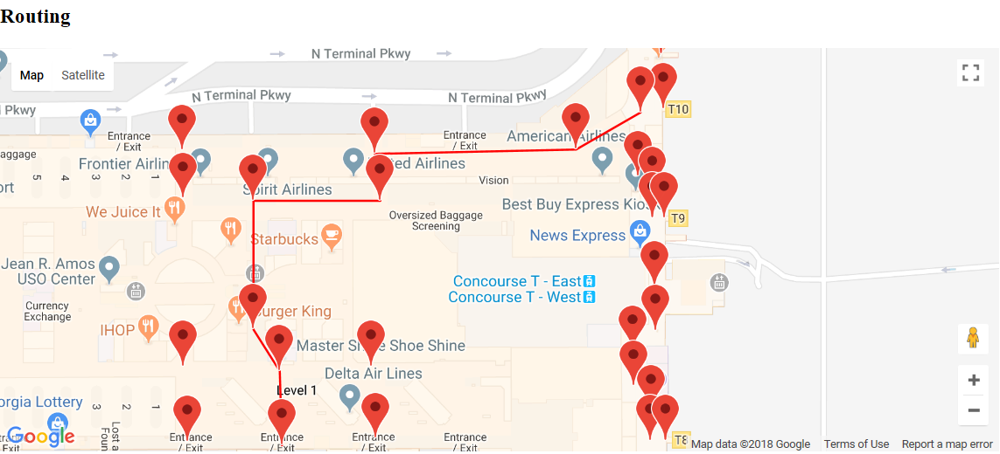

# Indoor-Routing
This project gives routes, using a set of markers created using geojson data, for one section of Hartsfield–Jackson Atlanta International Airport.

The project has 43 markers placed around the map and a graph is constructed using these markers:
```javascript
var graph = new DirectedGraph();
graph.addVertex('i', {'j': weight(data.features[i].geometry["coordinates"], data.features[j].geometry["coordinates"]),..});
```
where **i** specifies the vertex being added and **j** refers to the vertex to which there is an edge.

The coordinates are retrived from the GeoJson data, which is of the format
```javascript
{
  "type": "Feature",
  "geometry": {
    "type": "Point",
    "coordinates": [longitude,latitude]
  },
  "properties": {
    "name": "Location_name"
  }
}
```
To get the GeoJSON data, I used Google's Simple GeoJSON Editor https://google-developers.appspot.com/maps/documentation/utils/geojson/ which allows us to drag and drop markers for which the GeoJson is constructed.

The endpoint is then collected from the user by the use of a prompt
```javascript
var end_point = prompt("Please enter the end point(between 1-43):");
```
This value is then passec to the shortest path finding function which calculates all the intermediate vertices to be traversed using Dijkstra's Shortest Path Algorithm.

The pseudocode for Dijkstra's algorithm is given below.
```javascript
function Dijkstra(Graph, source):
       dist[source]  := 0                     // Distance from source to source is set to 0
       for each vertex v in Graph:            // Initializations
           if v ≠ source
               dist[v]  := infinity           // Unknown distance function from source to each node set to infinity
           add v to Q                         // All nodes initially in Q

      while Q is not empty:                  // The main loop
          v := vertex in Q with min dist[v]  // In the first run-through, this vertex is the source node
          remove v from Q 

          for each neighbor u of v:           // where neighbor u has not yet been removed from Q.
              alt := dist[v] + length(v, u)
              if alt < dist[u]:               // A shorter path to u has been found
                  dist[u]  := alt            // Update distance of u 

      return dist[]
  end function
```
In order to calculate the shortest distance between the vertices, since this is a weighted graph, I made use of the **haversine formula** which determines the great-circle distance between two points on a sphere given their longitudes and latitudes.
```javascript
function weight(a, b) {
  var R = 6371; // Radius of the earth in km
  var dLat = deg2rad(b[1] - a[1]); // deg2rad below
  var dLon = deg2rad(b[0] - a[0]);
  var temp = Math.sin(dLat / 2) * Math.sin(dLat / 2) +
             Math.cos(deg2rad(a[1])) * Math.cos(deg2rad(b[1])) *
             Math.sin(dLon / 2) * Math.sin(dLon / 2);
  var c = 2 * Math.atan2(Math.sqrt(temp), Math.sqrt(1 - temp));
  var d = R * c; // Distance in km
  return d;
}
                      
function deg2rad(deg) {
  return deg * (Math.PI / 180);
}
```
To plot the route between the markers, we retrieve the shortest path and store it in another variable
```javascript
var x_path = [];

for (i = 0; i < data.features.length; i++) {
	for (j = 0; j < out.shortestPaths[end_point].length; j++) {
		if (String(i) == out.shortestPaths[end_point][j]) {
			var x_i = i;
			x_path.push({
				lat: data.features[x_i].geometry.coordinates[1],
				lng: data.features[x_i].geometry.coordinates[0]
			});
		}
	}
}
x_path.push({
	lat: data.features[end_point].geometry.coordinates[1],
	lng: data.features[end_point].geometry.coordinates[0]
});

return x_path;

```
We then plot it using:
```javascript
var Path = new google.maps.Polyline({
            path: x_path,
            geodesic: true,
            strokeColor: '#FF0000',
            strokeOpacity: 1.0,
            strokeWeight: 2
          });
```
The resulting map using an example input of 13 is


## Note
1.In order to use the script, the user must request for an API - Key and replace it at:
```javascript
<script async defer src="https://maps.googleapis.com/maps/api/js?key=apikey&callback=initMap">
```
2.The script has only 43 markers. In order to add more we need to edit the variable **data** using the Google GeoJson editor and add the appropriate vertices and edges.


